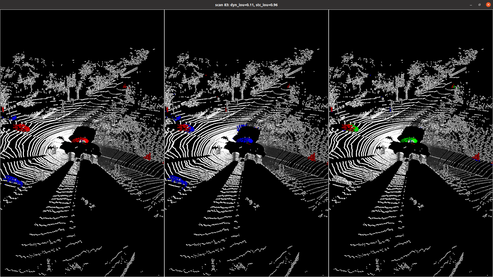
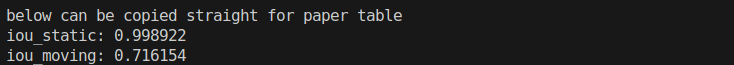
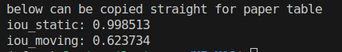

## MFMOS 源码阅读笔记
### 1 模型训练
#### 1.1 传入参数
```shell
DatasetPath=data/SemanticKITTI # 数据集路径
ArchConfig=./train_yaml/ddp_mos_coarse_stage.yml # 模型结构配置文件
DataConfig=./config/labels/semantic-kitti-mos.raw.yaml # 数据配置文件
LogPath=./log/Train # 日志保存路径
Pretrained=./log/Train/2025-7-18-11:36/MFMOS_valid_best_5 # 预训练权重
```
#### 1.2 模型结构配置文件

```yaml
# for mos dataset
n_input_scans: 8  # 输入残差帧数
residual: True    # 是否使用残差特征图
transform: False  # 是否开启残差特征图的数据增强
use_normal: False # 是否在投影图中使用法向量特征
```

```yaml
residual_aug: True # 使用不同步长生成残差图做数据增强（在transfer=True时生效）
valid_residual_delta_t: 1 # 正常残差图步长
```

#### 1.3 数据集处理

+ remove_few_static_frames：丢弃部分静态点云帧，因为太多的静态点云帧会导致训练时间加长

  ```shell
  Seq 00 drop 2983: 4541 -> 1558
    Drop residual_images_1 in seq01: 1101 -> 899
    Drop residual_images_2 in seq01: 1101 -> 899
    Drop residual_images_3 in seq01: 1101 -> 899
  ```

  ```shell
  There are 19130 frames in total. 
  Remove 10751 frames. 
   New use 8379 frames. 
   Using 8379 scans from sequences [0, 1, 2, 3, 4, 5, 6, 7, 9, 10]
  ```

+ class SemanticKitti(Dataset)：数据集对象

  ```python
  return proj_full,   						# (5+8, 64, 2048) 投影输入特征图
  	   proj_mask, 							# (64, 2048) 投影掩码
         (proj_labels, proj_movable_labels), 	# (64, 2048) 投影标签
         unproj_labels, 						# (150000) 逐点标签
         path_seq,      						# 序列号
         path_name,							# 索引标签
         proj_x, 								# (150000) 逐点投影X像素坐标
         proj_y,								# (150000) 逐点投影Y像素坐标
         proj_range, 							# (64, 2048) 投影距离特征
         unproj_range, 						# (150000) 逐点距离坐标
         proj_xyz, 							# (64, 2048) 投影坐标特征
         unproj_xyz,							# (150000) 逐点坐标坐标
         proj_remission, 						# (64, 2048) 投影强度特征
         unproj_remissions, 					# (150000) 逐点强度坐标
     	   unproj_n_points						# 有效点数
  ```


#### 1.4 权重保存


### 2 模型评估

#### 2.1 scripts/valid.sh

```shell
#!/bin/bash
DatasetPath=data/SemanticKITTI 	# 数据集路径
ModelPath=ckpt/mfmos_ckpt_ours 	# 模型权重路径
SPLIT=valid # valid or test		# 数据集类型

export CUDA_VISIBLE_DEVICES=0 
python3 infer.py -d $DatasetPath \
                 -m $ModelPath \
                 -l $SavePath \
                 -s $SPLIT \
                 --movable \
                 --pointrefine \  # 使用MFMOS_SIEM_valid_best权重，否则使用MFMOS_valid_best权重
```

#### 2.2 scripts/evaluate.sh

```shell
#!/bin/bash
DatasetPath=data/SemanticKITTI
PredictionsPath=./log/Valid/ckpt_iou7612_1stage/
DataConfig=./config/labels/semantic-kitti-mos.raw.yaml

python3 utils/evaluate_mos.py -d $DatasetPath \
                              -p $PredictionsPath \
                              -dc $DataConfig
```

#### 2.3 script/visualize.sh

```shell
#!/bin/bash
DatasetPath=data/SemanticKITTI
Seq=08
DataConfig=./config/labels/semantic-kitti-mos.raw.yaml
Version=moving # Version in ["moving", "movable", "fuse"] for predictions
PredictionPath=log/Valid/ckpt_ours_1stage/

python3 utils/visualize_mos.py -d $DatasetPath \
                               -s $Seq \
                               -c $DataConfig \
                               -v $Version \
                               -p $PredictionPath
```



+ 左图：真值，蓝色—可移动点，红色—运动点，白色—其它点

+ 中间：预测，蓝色—可移动点，红色—运动点，白色—其它点
+ 右图：对比，红色—TP，绿色—FN，蓝色—FP，白色—TN

### 3 复现日志

#### 3.1 开源权重 (mfmos_ckpt_iou7612)

+ 双分支单阶段模型

  

+ 双分支+SIEM两阶段模型

#### 3.2 自训练权重

+ 双分支单阶段模型

  

